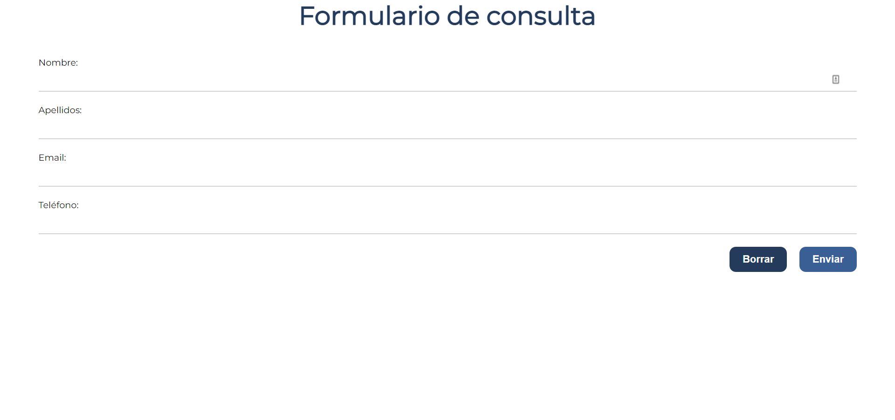

# Generate PDF in email from form

## About The Project

Éste proyecto en PHP lo hice hace un tiempo como idea, para probar formularios, y al enviarlos al correo se genere un PDF a partir de lo que has puesto en los campos. Es una primera idea que tuve para aprender y mejorar habilidades

-------------------------------------------------------------------------------

I did this project in PHP a while ago as an idea, to test forms, and when sending them to the mail, a PDF is generated from what you have put in the fields. It is a first idea i had to learn and improve skills

## Website screenshot

    

## Contact

Guillermo Pérez - [LinkedIn](https://linkedin.com/in/guillermo-perez-fuentes)